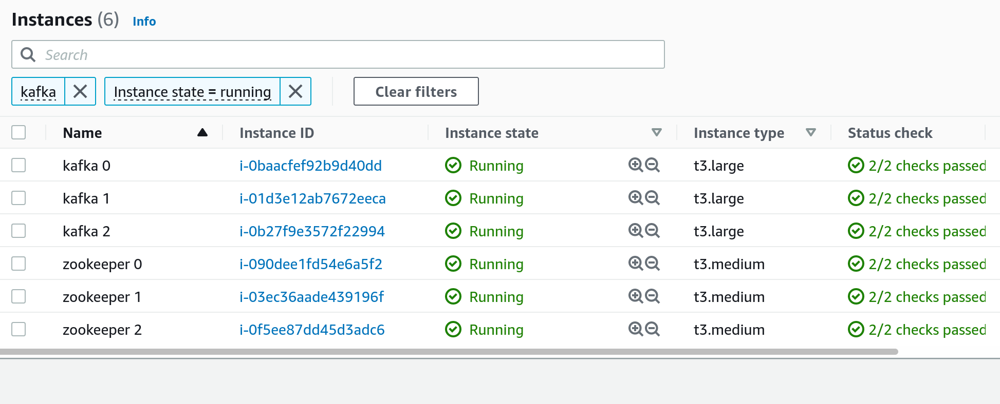

# Terraform AWS Kafka
Create a kafka cluster on AWS using Terraform

# Requirements

* An AWS Account
* [Packer](https://www.packer.io/) - to build AMIs - Tested with version 1.8.0
* [Terraform](https://www.terraform.io/) - to create the Kafka and zookeeper ec2 instances from the AMIs - Tested with version 0.14.10

# Installation

First you will need to create the zookeeper and kafka AMIs using packer.

From within the /packer folder, update variables.json to suit your AWS region and then run:

### Validate an image file(s)

```
packer validate -var-file=variables.json zookeeper.json
packer validate -var-file=variables.json kafka.json
```

### Build the image(s)

```
packer build -var-file=variables.json zookeeper.json
packer build -var-file=variables.json kafka.json
```

Once the AMIs have been created, use Terraform to create the Zookeeper and Kafka clusters:

### Plan

```
terraform init && terraform plan
```

### Apply

```
terraform init && terraform apply
```

The end result is a multi node kafka cluster and a Zookeeper ensemble, ready to develop on.



## Cost estimate

Cost estimate provider by Infracost

```
Project: gordonmurray/terraform_aws_kafka/.

 Name                                                       Monthly Qty  Unit                  Monthly Cost

 aws_instance.kafka[0]
 ├─ Instance usage (Linux/UNIX, on-demand, t3.large)                730  hours                       $60.74
 └─ root_block_device
    └─ Storage (general purpose SSD, gp2)                            50  GB                           $5.00

 aws_instance.kafka[1]
 ├─ Instance usage (Linux/UNIX, on-demand, t3.large)                730  hours                       $60.74
 └─ root_block_device
    └─ Storage (general purpose SSD, gp2)                            50  GB                           $5.00

 aws_instance.kafka[2]
 ├─ Instance usage (Linux/UNIX, on-demand, t3.large)                730  hours                       $60.74
 └─ root_block_device
    └─ Storage (general purpose SSD, gp2)                            50  GB                           $5.00

 aws_instance.zookeeper[0]
 ├─ Instance usage (Linux/UNIX, on-demand, t3.medium)               730  hours                       $30.37
 └─ root_block_device
    └─ Storage (general purpose SSD, gp2)                            50  GB                           $5.00

 aws_instance.zookeeper[1]
 ├─ Instance usage (Linux/UNIX, on-demand, t3.medium)               730  hours                       $30.37
 └─ root_block_device
    └─ Storage (general purpose SSD, gp2)                            50  GB                           $5.00

 aws_instance.zookeeper[2]
 ├─ Instance usage (Linux/UNIX, on-demand, t3.medium)               730  hours                       $30.37
 └─ root_block_device
    └─ Storage (general purpose SSD, gp2)                            50  GB                           $5.00

 aws_route53_record.zookeeper_1
 ├─ Standard queries (first 1B)                        Monthly cost depends on usage: $0.40 per 1M queries
 ├─ Latency based routing queries (first 1B)           Monthly cost depends on usage: $0.60 per 1M queries
 └─ Geo DNS queries (first 1B)                         Monthly cost depends on usage: $0.70 per 1M queries

 aws_route53_record.zookeeper_2
 ├─ Standard queries (first 1B)                        Monthly cost depends on usage: $0.40 per 1M queries
 ├─ Latency based routing queries (first 1B)           Monthly cost depends on usage: $0.60 per 1M queries
 └─ Geo DNS queries (first 1B)                         Monthly cost depends on usage: $0.70 per 1M queries

 aws_route53_record.zookeeper_3
 ├─ Standard queries (first 1B)                        Monthly cost depends on usage: $0.40 per 1M queries
 ├─ Latency based routing queries (first 1B)           Monthly cost depends on usage: $0.60 per 1M queries
 └─ Geo DNS queries (first 1B)                         Monthly cost depends on usage: $0.70 per 1M queries

 aws_route53_zone.domain
 └─ Hosted zone                                                       1  months                       $0.50

 OVERALL TOTAL                                                                                      $303.81
──────────────────────────────────
22 cloud resources were detected, rerun with --show-skipped to see details:
∙ 10 were estimated, 9 include usage-based costs, see https://infracost.io/usage-file
∙ 12 were free

Add cost estimates to your pull requests: https://infracost.io/cicd
```